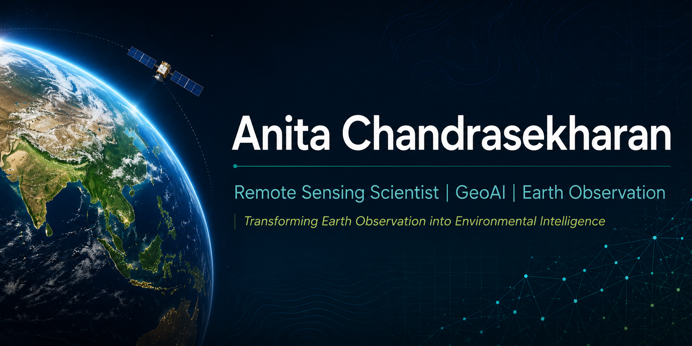

  

## Remote Sensing Scientist | GeoAI | Earth Observation

I am a Remote Sensing Scientist with a PhD in Remote Sensing & GIS from IIT Bombay, specializing in the application of Earth Observation, geospatial analytics, and GeoAI to address environmental and sustainability challenges.

My work focuses on transforming satellite observations into actionable environmental intelligence through geospatial analytics, machine learning, and cloud-based Earth observation technologies.

---

## Areas of Interest

- GeoAI
- Earth Observation
- Remote Sensing
- Environmental Intelligence
- Climate Analytics
- Hydrology
- Disaster Risk Assessment
- Sustainable Development

---

## Current Focus

I am currently building geospatial applications that combine satellite imagery, artificial intelligence, and spatial analytics for environmental monitoring and decision support.

Current areas of work include:

- Google Earth Engine
- GeoAI for Environmental Intelligence
- Machine Learning for Geospatial Analysis
- Interactive Geospatial Dashboards
- Cloud-native Earth Observation Workflows

---

## Featured Projects

### GeoAI Wildfire Risk Dashboard

A real-time GeoAI dashboard integrating NASA wildfire hotspots, meteorological data, infrastructure datasets, and spatial analytics to identify vulnerable infrastructure and visualize wildfire risk.

**Technology Stack**

Python • Streamlit • GeoPandas • PostGIS • Folium • NASA FIRMS • OpenStreetMap

Repository:
https://github.com/anita-chandrasekharan/geoai-wildfire-dashboard

---

### Urban Heat Island Analysis

Monitoring urban thermal patterns using Landsat imagery and Google Earth Engine.

*Work in Progress*

---

### Wetland Monitoring

Monitoring wetland dynamics using Sentinel-2 imagery and geospatial analytics.

*Work in Progress*

---

### NDVI Time Series Analysis

Long-term vegetation monitoring using satellite-derived NDVI time series.

*Work in Progress*

---

## Research Highlights

- PhD in Remote Sensing & GIS, IIT Bombay
- Department Silver Medalist (M.Tech), IIT Bombay
- Peer-reviewed international journal publications
- Research presented at AGU, EGU, and other international conferences

---

## Technical Skills

### Programming

Python

### Geospatial Technologies

Google Earth Engine

GeoPandas

GDAL

Rasterio

PostGIS

Shapely

PyProj

### GIS & Remote Sensing

ArcGIS Pro

QGIS

ENVI

ERDAS Imagine

### GeoAI & Analytics

Machine Learning

Spatial Analytics

Environmental Modelling

Data Visualization

---

## Currently Learning

- Deep Learning for Remote Sensing
- Cloud-native Geospatial Computing
- Computer Vision for Earth Observation
- Large-scale GeoAI Workflows

---

## Connect

**LinkedIn**

https://www.linkedin.com/in/anita-chandrasekharan/

---

*"Transforming Earth Observation into Environmental Intelligence."*
